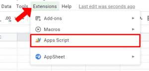
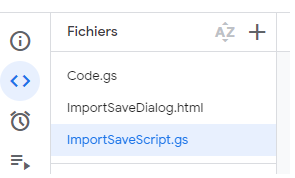

# FAPI INFO Save importer

All credits goes to Hiroko for the spreadsheet itself; and to https://github.com/gendelbendel/fapi-tools for the save import code

# What is it?

This is a short guide how to add a save file importer to Hiroko spreadsheet

# What does it do?

It currently fills for you
  - Infinity corner tab
  - Residue shop tab
  - Card powers tab
  - what pet is caught, and the current pity progress
  - the pet rank
  - the current wave for each expedition

# How to

Start by opening the script editor, google will ask you to allow to trust code execution. You can proceed, but if you don't want to, you can leave this guide now, thanks for visiting.

Now you should be able to see the default script Hiroko included in the spreadsheet, which is named Code.gs

Proceed to add 2 files named:
  - ImportSaveDialog **! make sure it's an HTML document**
  - ImportSaveScript **! make sure it's a script document**

Then copy paste the 2 respective files present in this github repo into those respective files

Save everything and refresh the spreadsheet view. A '🥔 Menu' should appear on the top bar.

You can now open this menu and import your save file located in %AppData%\..\LocalLow\Oni Gaming\Farmer Against Potatoes Idle

